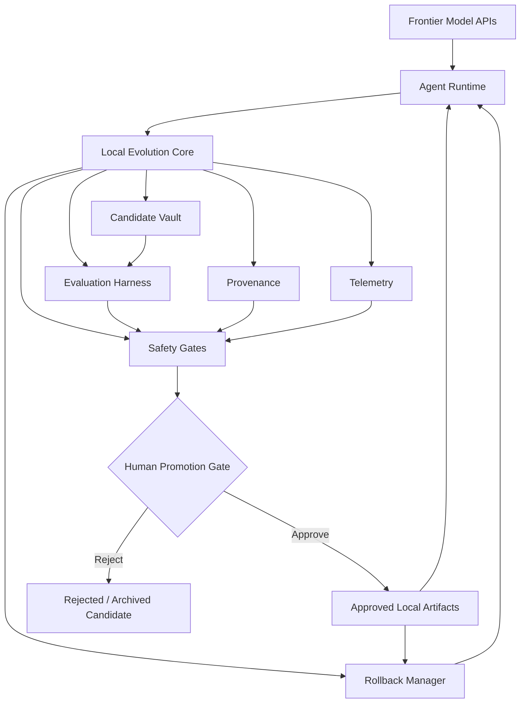
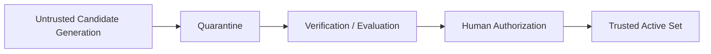

# Conceptual Architecture

Local Evolution Core (LEC) is designed as a control layer around immutable frontier-model APIs. The architecture separates candidate generation, evaluation, safety checks, promotion, and rollback.

## Components

### Frontier Model APIs

Externally provided foundation models. Their weights and provider controls are treated as immutable from the perspective of LEC.

### Agent Runtime

The environment in which tasks are executed. It may include prompts, tool adapters, memory, skills, workflows, and task orchestration.

### Local Evolution Core

The coordination layer responsible for handling candidate improvements and enforcing the experimental lifecycle.

### Candidate Vault

Stores proposed local artifacts before promotion. Candidates remain separated from the active runtime until evaluation and approval are complete.

Candidate examples may include:

- prompt revisions
- reusable strategies
- tool-use policies
- memory structures
- routing rules
- evaluation procedures
- workflow templates

### Evaluation Harness

Runs candidate-versus-baseline comparisons on held-out, sealed, adversarial, or transfer tasks.

It should support repeated trials and, where possible, independent evaluators from different model families.

### Telemetry

Records operational evidence such as task outcomes, token usage, tool calls, evaluation status, rollback events, and promotion history.

Telemetry is intended for audit and comparison, not for storing hidden chain-of-thought traces.

### Provenance

Tracks where a candidate came from and how it changed over time.

A provenance record should make it possible to reconstruct:

- source version
- proposing system
- candidate identifier
- evaluation history
- promotion decision
- successor / rollback relationship

### Safety Gates

Apply predefined integrity and policy checks before a candidate can reach human review.

Potential checks include:

- protected-file integrity
- scope restrictions
- resource ceilings
- regression thresholds
- evaluation completeness
- provenance completeness
- prohibited external side effects

### Rollback Manager

Maintains a reversible path from a promoted artifact to a previously approved state.

Promotion is therefore treated as a versioned transition rather than an irreversible overwrite.

### Human Promotion Gate

The final authorization point during the research phase.

Models can generate evidence and recommendations, but they do not independently authorize their own promotion.

### Approved Local Artifacts

Only artifacts that pass the required gates and receive human approval enter the active agent environment.

## Trust boundaries

A useful conceptual separation is:

The candidate side is treated as untrusted by default. Trust is earned through evidence and explicit authorization rather than inherited from the proposing model.

## Design constraints

LEC favors architectures where:

- protected evaluation assets are outside ordinary candidate-write scope
- candidate and active states are distinct
- version history is append-friendly
- evaluation can be reproduced
- promotion can be audited
- rollback can be performed without reconstructing lost state
- model-provider controls remain external and intact

## Non-goals

This architecture is not intended to provide:

- unrestricted autonomous propagation
- direct modification of foundation-model weights
- provider-control bypass
- invisible self-promotion
- uncontrolled authority expansion

The architectural goal is narrower: make local iterative improvement experimentally useful while preserving strong boundaries around what can change, how it is evaluated, and who authorizes deployment.