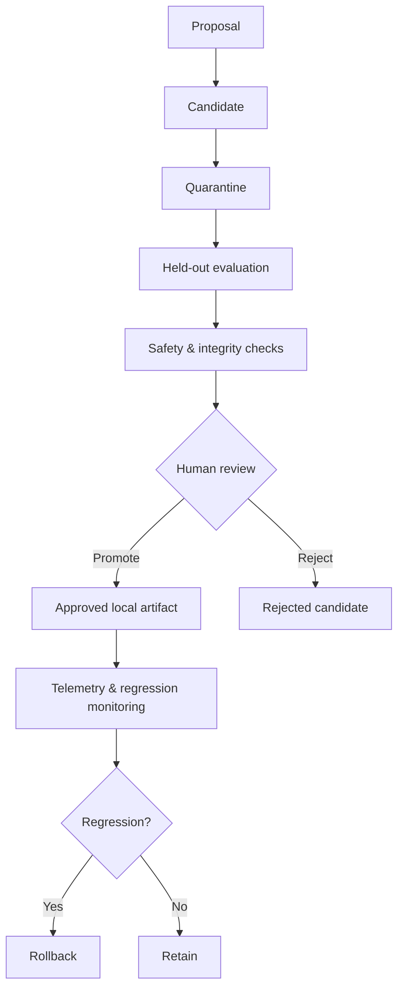

# Local Evolution Core

**Experimental research framework for bounded, observable, and reversible local improvement in frontier-model agent systems.**

Local Evolution Core (LEC) studies whether AI agents can accumulate useful improvements to their **local operating environment**—prompts, tools, strategies, memory, workflows, evaluation procedures, and reusable artifacts—while the underlying frontier model remains unchanged.

> **Research status:** ongoing. This repository documents the design, safety assumptions, and planned evaluation methodology. It does **not** claim that recursive self-improvement has been demonstrated.

## Research question

**Can agent-generated improvements persist and generalize without creating uncontrolled self-modification, evaluator exploitation, regressions, or unsafe propagation?**

The project focuses on scaffold-level change rather than model-weight change. In this framing, a frontier model is treated as an externally provided, immutable reasoning engine; local evolution occurs in the surrounding system.

## Model vs. local evolution

| Foundation model | Local evolution layer |
|---|---|
| Externally provided | Locally controlled |
| Model weights remain unchanged | Prompts and strategies may change |
| Provider safety controls remain intact | Tools and workflows may be revised |
| API/model is not self-modified | Memory and reusable artifacts may evolve |
| No quota/security bypass | Evaluation procedures may be improved |

## Core principles

- **Immutable foundation model** — no model-weight self-modification.
- **Local, inspectable artifacts** — improvements exist as reviewable files, rules, workflows, or policies.
- **Quarantine before promotion** — generated candidates are not automatically trusted.
- **Evaluation precedes deployment** — candidates should face held-out or sealed tests before promotion.
- **Human-controlled promotion** — final promotion remains an explicit human decision.
- **Rollback by design** — promoted artifacts should be reversible.
- **Provenance preservation** — changes should retain origin and evaluation history.
- **Bounded resources** — improvement processes operate under explicit limits.
- **Independent evaluation where possible** — proposer and evaluator roles should be separated.

## Experimental lifecycle

## Research areas

The project is intended to study:

- generalization of persistent improvements
- evaluator exploitation and reward hacking
- cross-model evaluator disagreement
- regression after promotion
- transfer across tasks or agents
- robustness under distribution shift
- efficiency changes in token/tool usage
- persistent memory and tool-use strategies
- safety of scaffold-level adaptation
- human oversight and promotion gates

## Evaluation sketch

The central comparison is between a **baseline agent** and an **agent allowed to retain locally generated improvements**.

Potential roles include:

- **Proposer** — generates a candidate improvement.
- **Independent evaluator** — judges whether the change helps on held-out tasks.
- **Adversarial critic** — looks for failure modes, overfitting, or evaluator exploitation.
- **Objective test harness** — measures task outcomes and regressions.
- **Human reviewer** — controls final promotion.

Planned metrics include task success, regression rate, token and tool efficiency, evaluator disagreement, transfer performance, failed-promotion rate, rollback frequency, and out-of-distribution performance.

## Safety boundaries

LEC is not designed to bypass provider controls or create unrestricted autonomous self-modification.

The research explicitly excludes:

- model-weight self-modification
- provider security or quota bypass
- unauthorized external actions
- uncontrolled propagation
- automatic self-promotion

See **[SAFETY.md](SAFETY.md)** for the full safety model.

## Repository map

- **[RESEARCH.md](RESEARCH.md)** — motivation, hypotheses, experiments, metrics, and limitations
- **[SAFETY.md](SAFETY.md)** — safety boundaries and control model
- **[EVALUATION.md](EVALUATION.md)** — evaluation methodology and planned tests
- **[ARCHITECTURE.md](ARCHITECTURE.md)** — conceptual system architecture
- **[ROADMAP.md](ROADMAP.md)** — staged research plan
- **[CONTRIBUTING.md](CONTRIBUTING.md)** — contribution guidance

## Current status

The project is in an **experimental infrastructure and validation phase**. Public documentation intentionally distinguishes implemented safety scaffolding from future live-fire research claims. Benchmark results, if published later, should be accompanied by methodology, limitations, and enough detail to make the evidence auditable.

## License

This repository is documentation-first. See [LICENSE](LICENSE) for terms.

---

### Why this matters

Frontier-model agents increasingly operate inside persistent environments containing prompts, tools, memory, workflows, and reusable skills. Even when model weights do not change, those systems can become more capable as their surrounding scaffolding evolves. LEC asks whether that process can be studied under explicit controls for evaluation integrity, observability, rollback, provenance, and human oversight.
